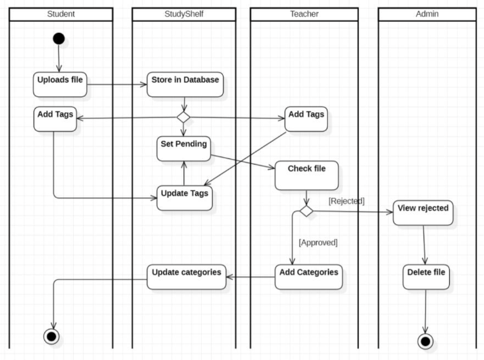

# StudyShelf
## Introduction
The project is a Java-based Classroom Resource Sharing Platform designed to become 
a platform that teachers and students can use to easily share useful educational resources for their studies.
The platform aims to enhance learning efficiency and resource accessibility in educational environments,
making it easier for teachers and students to collaborate and access useful study materials.  

## Key Features

    1. User Role Management

   - Multiple user roles
   - Differentiated access and permissions
   - Secure authentication and authorization

    2. Course Management

   - Techer can create and manage courses/categories
   - Teacher can approve/reject pending materials

    3. Study Material Interactions

   - Download educational resources
   - Upload and organize study materials
   - Write and read reviews
   - Rate materials
   - Material engagement tracking

## Technical Architecture

 - Java-based application
 - JavaFX for user interface
 - Hibernate/JPA for database interactions
 - Modular design with separate layers:
   - Domain (models)
   - Service (business logic)
   - Presentation (controllers, components)
   - Repository (data access)
   

## User Experience Highlights
 - Personalized home dashboard
 - Search and filter capabilities
 - Review and rating system
 
  
## Instructions

Install https://sourceforge.net/projects/vcxsrv/ (windows)
- Launch VcXsrv using the "XLaunch" application.
- Select "Multiple windows" and click "Next".
- Choose "Start no client" and click "Next".
- Ensure "Disable access control" is checked and click "Finish"

In terminal: set DISPLAY="Your-IP-Address":0.0

Create .env file in project root folder:

- DB_PASSWORD = "youruserDBpassword"  
- DB_ROOT_PASSWORD = "yourDBrootpassword"  
- DOWNLOADS_DIR=C:/Users/"yourusername"/Downloads  
- or you can choose other folder. Folder will be shared with docker image to store dowloaded files and upload files.  

Start Docker Desktop  
 
Start run-remote-studyshelf-full.bat in project root folder.

## Activity Diagram

Developed by Group 6 at Metropolia UAS, 2025.
=

